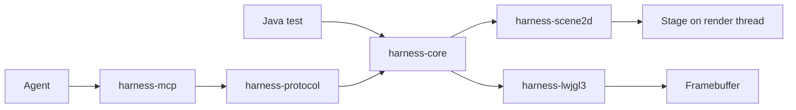

# libGDX UI Harness Design

**Date:** 2026-07-28  
**Status:** Approved design, pending written-spec review

## 1. Purpose

Build a separate Java library that lets coding agents inspect, drive, assert, and diagnose libGDX Scene2D user interfaces with reliability comparable to Playwright. V1 prioritizes semantic reliability over feature breadth or pixel-first automation.

The primary user is an agent working on a live or test-launched LWJGL3 desktop application. The same behaviors remain available to ordinary Java integration tests.

## 2. V1 success criteria

V1 is successful when it can:

1. Attach one harness instance to a Scene2D `Stage` without requiring custom widget subclasses.
2. Produce a bounded, immutable semantic tree containing hierarchy, role, accessible name, text, test ID, widget state, visibility, touchability, focus, z-order, local bounds, stage bounds, and screen bounds.
3. Resolve lazy strict locators by role/name, label, text, test ID, actor name/type, and structural filters.
4. Perform click, hover, focus, text entry, key input, scroll, drag, and pointer actions through libGDX input dispatch.
5. Auto-wait for attachment, uniqueness, visibility, enabled/touchable state, stable geometry, and an unobscured hit target using a monotonic deadline.
6. Advance controlled UI time in deterministic frame steps for fixture applications.
7. Capture full-window and actor-clipped screenshots after a completed rendered frame.
8. Expose inspection, location, action, waiting, screenshot, and tracing through both a Java API and typed MCP tools.
9. Return typed failures containing enough bounded evidence for an agent to select its next corrective action without parsing logs.
10. Record a portable trace containing commands, timing, before/after semantic snapshots, input events, errors, logs, and optional screenshots.

## 3. Non-goals for V1

- Android, iOS, GWT/HTML, or RoboVM runtime support.
- Arbitrary SpriteBatch, ShapeRenderer, 3D, or non-Scene2D UI semantics.
- OS-level black-box desktop automation.
- Computer-vision element discovery.
- General remote code execution, reflection, arbitrary method calls, or filesystem access.
- A visual trace-viewer application. V1 defines and emits the trace format; a viewer may follow.
- Full accessibility conformance auditing. Semantic roles and names are automation contracts, not an audit certificate.

## 4. Architecture

### 4.1 `harness-core`

Owns backend-neutral immutable semantic models, locator composition and strictness, actionability state, monotonic deadlines, polling policy, assertion results, trace events, limits, and the public Java façade.

It does not depend on libGDX, LWJGL, JSON, MCP, or a specific test framework.

### 4.2 `harness-scene2d`

Adapts a `Stage` and its actors to the core interfaces. It owns:

- render-thread command marshalling;
- deterministic actor-tree traversal and z-order;
- coordinate conversion across actor, stage, viewport, and screen spaces;
- built-in Scene2D.UI semantic adapters;
- metadata attached without subclassing actors;
- hit-target and obscuration checks;
- focus and widget-state extraction;
- input dispatch through `Stage`/`InputProcessor`;
- fixed-step `Stage.act` support in controlled fixtures.

No live libGDX object crosses this module’s outward model boundary.

### 4.3 `harness-lwjgl3`

Owns LWJGL3-specific window lifecycle hooks, completed-frame synchronization, framebuffer readback, vertical correction, image encoding, actor clipping, and reference viewport configuration.

### 4.4 `harness-protocol`

Defines versioned command, result, event, error, capability, and trace schemas. The schema is transport-neutral and does not import MCP types. Every request carries a protocol version, session ID, request ID, deadline, and bounded payload.

### 4.5 `harness-mcp`

Maps protocol operations to a small typed MCP tool set. It is an adapter, not the domain layer. Tools return compact structured results with optional artifact references rather than embedding unbounded trees or images.

Initial tools:

- `ui_sessions`
- `ui_snapshot`
- `ui_query`
- `ui_action`
- `ui_wait`
- `ui_screenshot`
- `ui_trace_start`
- `ui_trace_stop`
- `ui_capabilities`

A compact operation set is preferable to one tool per locator or action because agents can discover the complete schema without an oversized tool catalog.

## 5. Installation and lifecycle

A game creates one harness session for each Stage it exposes. Installation records Stage ownership, registers semantic metadata support, and binds a render-thread scheduler. Disposal closes the session and rejects later requests with a typed session-closed error.

The harness does not replace the game’s `InputProcessor`, game loop, or Stage. It routes input through the same configured processor path used by the application. Fixture helpers may provide an owned LWJGL3 application and deterministic loop, but production attachment remains non-owning.

Multiple Stages are separate named roots. Cross-stage locators are rejected unless the caller first selects a session/root.

## 6. Semantic model

Each snapshot has a monotonically increasing revision and frame number. Each node contains:

- snapshot-local node ID;
- parent ID and ordered child IDs;
- semantic role and accessible name;
- normalized visible text and optional label relationship;
- explicit test ID;
- actor name and actor/widget type as fallback diagnostics;
- visible, touchable, enabled, checked, selected, expanded, editable, focused, and focusable state when meaningful;
- local, stage, and screen-space bounds;
- effective color alpha, clipping, and viewport intersection;
- z-order and hit-test result;
- adapter-specific bounded properties.

Node IDs are not durable handles. Locators are durable query descriptions and always re-resolve against a fresh snapshot.

### 6.1 Semantic metadata

Games can set role, accessible name, test ID, labels, and bounded custom properties through a harness metadata API without subclassing actors. Built-in adapters infer semantics for common Scene2D.UI widgets, while explicit metadata overrides inferred values.

Custom actor adapters are registered by actor class and return immutable semantic contributions. Adapters cannot execute arbitrary remote commands.

## 7. Locators

Locator preference mirrors user-visible intent:

1. role plus accessible name;
2. associated label;
3. visible text;
4. explicit test ID;
5. actor name or type;
6. structural relationships and property filters.

Locators are composable with descendant, child, parent, sibling, `has`, `hasText`, state, and index filters. Index filters are permitted but diagnostics flag them as structurally fragile.

Strict operations require exactly one match. Zero matches produce `not-found`; multiple matches produce `strictness-violation`. Both include a bounded candidate summary and suggestions based on discriminating roles, names, test IDs, and ancestors.

Text matching normalizes Unicode whitespace. APIs distinguish exact, case-insensitive exact, substring, and regular-expression matching.

## 8. Actions and actionability

Every action follows this sequence:

1. Resolve the locator against a fresh snapshot.
2. Enforce strictness.
3. Evaluate action-specific actionability.
4. If unsatisfied, wait for the next frame/state signal until the monotonic deadline.
5. Re-resolve; never retain an Actor across waits.
6. Compute the action point and validate it through Stage hit testing.
7. Dispatch input through libGDX input APIs on the render thread.
8. Wait for input processing and a completed post-action frame.
9. Capture the resulting semantic revision and trace evidence.

Click requires attached, visible, touchable/enabled, stable geometry for two consecutive frames, viewport intersection, and the intended actor or descendant as hit target. Keyboard actions require or establish keyboard focus. Scroll requires the selected actor or ancestor to accept scroll focus. `force` may bypass actionability checks but never render-thread confinement or strict locator matching.

No implementation may use sleeps as synchronization.

## 9. Time and determinism

Production-attached sessions observe the application’s clock and frames. Controlled fixture sessions use an injected monotonic clock and explicit fixed-duration frame advancement. Auto-waits depend on monotonic elapsed time, never wall-clock time.

Trace events record logical time, frame number, snapshot revision, request ID, and causal parent event. Replaying a trace validates semantic transitions and command ordering; it does not promise byte-identical GPU output across machines.

## 10. Screenshots and visual evidence

Screenshots are captured only after render completion on the owning graphics context. The LWJGL3 adapter converts OpenGL framebuffer orientation to conventional top-left image coordinates and records viewport/window dimensions and scale.

Actor screenshots crop by final screen-space bounds and clip to the framebuffer. Empty or offscreen crops fail with typed geometry evidence. Pixel comparisons are reserved for stable fixture assets and controlled GPU environments; semantic snapshots remain the primary regression contract.

## 11. Threading and concurrency

All Stage and Actor access runs on the application render thread. The MCP server may handle connections on Java virtual threads, but each session serializes commands in request order unless a read is explicitly served from an already-published immutable snapshot.

A request deadline includes queue time. Cancellation prevents commands that have not begun; an action already dispatched completes atomically and reports its final state. Session disposal cancels queued work and releases trace/image resources.

## 12. Errors and diagnostics

The public error taxonomy is:

- `invalid-request`
- `unsupported-capability`
- `session-not-found`
- `session-closed`
- `not-found`
- `strictness-violation`
- `not-actionable`
- `timeout`
- `render-thread-failure`
- `capture-failure`
- `protocol-version-mismatch`
- `internal-error`

Every error includes stable code, human-readable message, request ID, session ID, locator when relevant, elapsed duration, last snapshot revision, trace reference, and bounded structured evidence. Internal exceptions are retained in local traces but remote responses redact stack traces and filesystem paths by default.

## 13. Security and limits

The MCP boundary permits only declared operations. It never accepts class names to instantiate, method names to invoke, scripts to evaluate, or paths to read.

Configurable hard limits cover request bytes, response bytes, snapshot depth, nodes, matches, property count, string length, screenshot dimensions, trace duration/bytes, concurrent sessions, queued requests, regular-expression complexity, and deadlines. Limit failures are explicit and traceable.

The default binding is loopback. Non-loopback serving requires explicit authentication configuration and is outside the default developer workflow.

## 14. Java and build baseline

Use JDK 25 and Gradle 9.1 or newer. JDK 25 reached GA on 2025-09-16 and is an LTS release from most vendors. Gradle officially supports running on Java 25 beginning with 9.1.0.

The project may use stable Java 25 language and runtime APIs. It must not use preview or incubator APIs in published artifacts. Virtual threads suit independent MCP connections; scoped values can carry request context without thread-local leakage; JFR improvements support diagnosis; compact object headers are a runtime benefit. None of these features may leak into protocol semantics.

The accepted tradeoff is that consumers must run the desktop integration on Java 25. If later backend adoption requires older bytecode, that is a separately measured compatibility decision rather than an untested V1 abstraction.

## 15. Verification strategy

### 15.1 Pure tests

Test semantic models, locator composition, text normalization, strictness, actionability transitions, deadlines, limits, serialization, and error evidence without libGDX.

### 15.2 Scene2D integration fixtures

Run real Stage/widget fixtures on the render thread. Cover transformed/nested groups, clipping, viewports, overlap, visibility, disabled/touchable states, focus, scroll panes, dynamic replacement, actions, and animations. Tests assert observable semantics and input outcomes rather than listener internals.

### 15.3 LWJGL3 smoke scenarios

Launch a real reference application, inspect it through the harness, click/type/scroll, capture a screenshot, and close cleanly. Linux CI runs with a virtual display; Windows and macOS jobs validate native/backend portability.

### 15.4 Protocol and MCP contracts

Validate schemas from serialized requests through returned results, including version mismatch, cancellation, bounds, redaction, and artifact references. Tool descriptions and schemas are golden compatibility artifacts.

### 15.5 Trace tests

Record deterministic fixture sessions, validate causal ordering and required evidence, replay semantic transitions, and confirm bounded artifact cleanup.

### 15.6 Agent parity benchmark

A fixed corpus of UI change tasks runs against both this harness and a Playwright reference app with equivalent semantics. Record:

- successful task completion rate;
- locator/action timeout rate;
- median agent tool calls to diagnose and fix;
- proportion of failures with actionable structured evidence;
- repeatability over at least 20 runs per scenario;
- trace completeness and artifact size.

V1 parity requires the libGDX harness to match or beat the Playwright baseline on successful completion and diagnostic completeness for the supported corpus, with no statistically meaningful increase in flaky failures. Raw API feature count is not a release criterion.

## 16. Delivery sequence

1. Establish build, module boundaries, dependency rules, and CI.
2. Define immutable semantic/protocol contracts and limits.
3. Implement locator parsing/composition and strict query evaluation.
4. Implement Scene2D snapshot extraction and metadata/adapters.
5. Implement render-thread scheduling, deterministic fixture clock, and waits.
6. Implement input actions and actionability.
7. Implement LWJGL3 completed-frame screenshots.
8. Implement versioned protocol service and MCP adapter.
9. Implement traces and artifact lifecycle.
10. Build the parity corpus, harden diagnostics/security, and publish release artifacts.

Each step is test-first and ends with an executable scenario proving the new vertical slice.

## 17. Primary references

- [libGDX Scene2D documentation](https://libgdx.com/wiki/graphics/2d/scene2d/scene2d)
- [Playwright locators](https://playwright.dev/docs/locators)
- [Playwright auto-waiting and actionability](https://playwright.dev/docs/actionability)
- [Playwright trace viewer](https://playwright.dev/docs/trace-viewer-intro)
- [OpenJDK 25 project](https://openjdk.org/projects/jdk/25/)
- [Gradle Java compatibility matrix](https://docs.gradle.org/current/userguide/compatibility.html)
